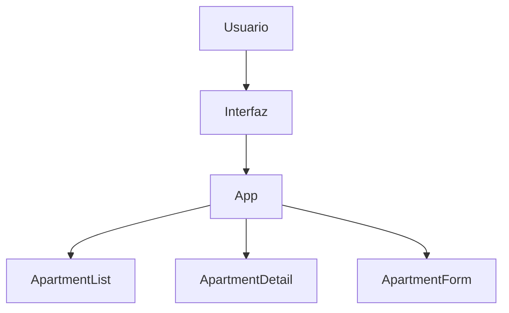
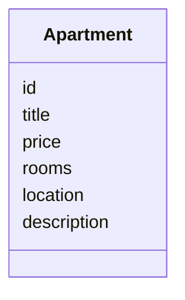
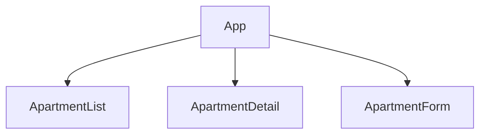
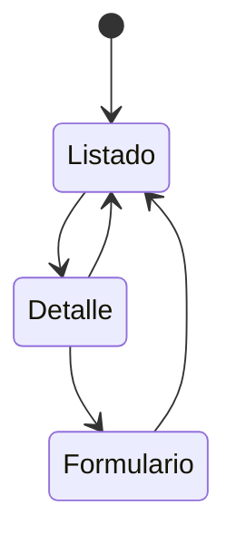

# PRA01 – Apartment Predictor
**Single Page Application (SPA) con React + Vite**  
IFCD0210 – Desenvolupament d’aplicacions amb tecnologies web  
CIFO La Violeta – Edición 2026

---

## 1. Introducción

Este proyecto corresponde al ejercicio **PRA01**, cuyo objetivo es el desarrollo de una **aplicación web SPA** utilizando **React y Vite** como frontend del sistema *ApartmentPredictor*.  
La aplicación permite gestionar una lista de apartamentos mediante operaciones **CRUD completas**, utilizando datos simulados (mock data) en lugar de un backend real.

---

## 2. Objetivo del ejercicio

Los objetivos principales del ejercicio son:

- Crear un proyecto moderno con **Vite + React**
- Modelar datos de apartamentos mediante una capa estática en `/data`
- Implementar operaciones **Create, Read, Update y Delete**
- Usar **renderizado condicional** para gestionar las vistas
- Aplicar una arquitectura clara de componentes
- Documentar el proyecto con diagramas y capturas

---

## 3. Inicialización del proyecto

**Opción elegida para la base del proyecto:**  
**Opción A – Crear un proyecto nuevo con Vite + React**

El proyecto se ha creado desde cero usando Vite, sin partir del repositorio stub proporcionado.  
Esto permite un mayor control sobre la estructura, el estado y los componentes.

---

## 4. Arquitectura general

La aplicación sigue una arquitectura SPA basada en componentes y estado centralizado.

---

## 5. Modelado de datos

Los datos de los apartamentos se definen en un archivo estático dentro de `/src/data`.  
El modelo se ha mantenido sencillo para centrarse en la lógica CRUD y el renderizado condicional.

---

## 6. Arquitectura de componentes

La aplicación se divide en los siguientes componentes principales:

- **ApartmentList**: muestra el listado de apartamentos
- **ApartmentDetail**: muestra el detalle de un apartamento seleccionado
- **ApartmentForm**: formulario reutilizable para crear y editar

---

## 7. Renderizado condicional y flujo de estados

La navegación entre vistas se realiza mediante **renderizado condicional**, controlado por una variable de estado `mode`.

Este enfoque evita el uso de librerías de routing y mantiene la lógica clara y controlada.

---

## 8. Implementación del CRUD

Las operaciones CRUD se implementan usando `useState`:

- **Create**: añadir nuevos apartamentos
- **Read**: listar y visualizar detalles
- **Update**: editar apartamentos existentes
- **Delete**: eliminar apartamentos

Los cambios se reflejan inmediatamente en la interfaz.

---

## 9. Diseño visual y UX

- Diseño basado en **cards**
- Grid responsive
- Fondo oscuro para resaltar el contenido
- Adaptación correcta a dispositivos móviles
- Formularios claros y accesibles

---

## 10. Capturas de pantalla

### Vista de listado

### Vista de detalle

### Formulario de creación / edición

### Vista responsive móvil

---

## 11. Opción elegida – Opción 4

El enunciado del PRA01 solicita elegir una opción adicional entre las tareas 4, 5 y 6, o proponer una alternativa.

En este proyecto se ha optado por una **Opción 4 personalizada**, consistente en:

- Desarrollo completo del frontend con **React + Vite**
- Implementación de CRUD completo usando datos simulados
- Uso intensivo de renderizado condicional
- Arquitectura clara de componentes y estado
- Diseño responsive y experiencia de usuario cuidada
- Documentación técnica con diagramas y capturas

El proyecto queda preparado para una futura integración con un backend en **Spring Boot**, pero sin conexión real en esta fase, tal como requiere el ejercicio.

---

## 12. Retos y soluciones

- **Gestión del estado**: centralizada en el componente `App`
- **Renderizado condicional**: resuelto mediante un único estado `mode`
- **Diseño responsive**: implementado con CSS Grid y media queries
- **Documentación**: apoyada en Mermaid y capturas reales

---

## 13. Conclusión

El proyecto cumple todos los requisitos del **PRA01**, demostrando la capacidad de diseñar, implementar y documentar una SPA moderna con React y Vite, siguiendo buenas prácticas y los objetivos formativos del IFCD0210.

