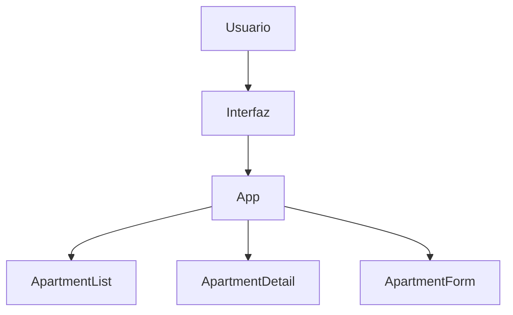
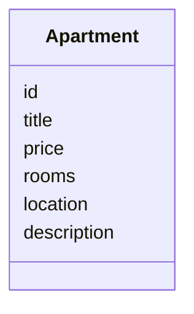
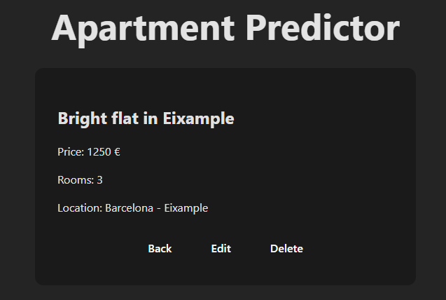
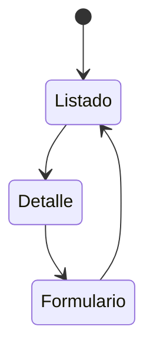
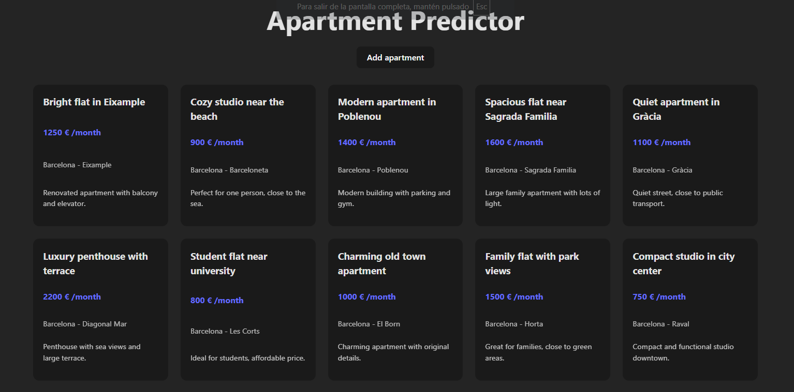

# PRA01 – Apartment Predictor

Single Page Application (SPA) con React + Vite  
IFCD0210 – Desenvolupament d’aplicacions amb tecnologies web  
CIFO La Violeta – Edición 2026

---

## 1. Introducción

Este proyecto corresponde al ejercicio **PRA01**, cuyo objetivo es el desarrollo de una **Single Page Application (SPA)** utilizando **React + Vite** como frontend del sistema _ApartmentPredictor_.

La aplicación implementa un sistema completo de gestión de apartamentos mediante operaciones **CRUD (Create, Read, Update, Delete)** utilizando datos simulados (mock data), sin conexión a backend en esta fase.

---

## 2. Objetivo del ejercicio

Durante el desarrollo del proyecto he trabajado los siguientes objetivos técnicos:

- Crear un proyecto moderno con **Vite + React**
- Implementar una arquitectura basada en componentes
- Centralizar el estado en el componente principal
- Aplicar renderizado condicional para gestionar vistas
- Implementar operaciones CRUD completas
- Documentar el sistema mediante diagramas y capturas

---

## 3. Arquitectura general

La aplicación sigue un modelo SPA con estado centralizado en `App`.



El componente `App` actúa como contenedor principal y controla:

- El estado global de la aplicación
- La vista activa
- La lista de apartamentos
- El apartamento seleccionado

---

## 4. Estructura del proyecto

```
src/
 ├── components/
 │    ├── ApartmentList.jsx
 │    ├── ApartmentDetail.jsx
 │    └── ApartmentForm.jsx
 ├── data/
 │    └── apartments.js
 ├── App.jsx
 └── main.jsx
```

- **App.jsx** → Componente contenedor (estado centralizado)
- **ApartmentList** → Listado de apartamentos
- **ApartmentDetail** → Vista de detalle
- **ApartmentForm** → Formulario reutilizable para crear/editar
- **data/** → Mock data estática

---

## 5. Modelado de datos

El modelo de datos se define en `/src/data`:



---

## 6. Flujo de datos y arquitectura técnica

El estado principal se centraliza en `App` mediante `useState`.

Flujo unidireccional de datos:

App (estado)  
↓ props  
Componente hijo  
↑ callback  
App actualiza estado → re-render

---

### 🔎 Vista Detalle



---

### Gestión de vistas

La navegación se controla mediante una variable de estado `mode`:

- `"list"`
- `"detail"`
- `"form"`



---

### 📋 Vista Listado



---

## 7. Implementación del CRUD

Las operaciones CRUD se implementan en `App`:

- **Create** → Añadir apartamento al array de estado
- **Read** → Listado y vista de detalle
- **Update** → Modificación mediante `map`
- **Delete** → Eliminación mediante `filter`

Las actualizaciones del estado provocan re-render automático.

---

### ➕ Vista Formulario (Crear / Editar)


---

## 8. Decisiones técnicas

- Estado centralizado en `App`
- Componentes hijos desacoplados
- Renderizado condicional en lugar de routing
- Uso de mock data
- Diseño responsive con CSS Grid

---

### 📱 Vista Responsive (Mobile)


---

## 9. Retos y soluciones

- Control del flujo de vistas → Estado `mode`
- Sincronización de estado → Centralización en `App`
- CRUD sin backend → Datos simulados
- Organización del código → Separación clara de componentes

---

## 10. Conclusión

Este proyecto básico demuestra la implementación y la documentación de una SPA moderna con React y Vite, aplicando principios de arquitectura basada en componentes, gestión centralizada del estado y flujo unidireccional de datos.

El sistema queda preparado para una futura integración con backend en Spring Boot.
